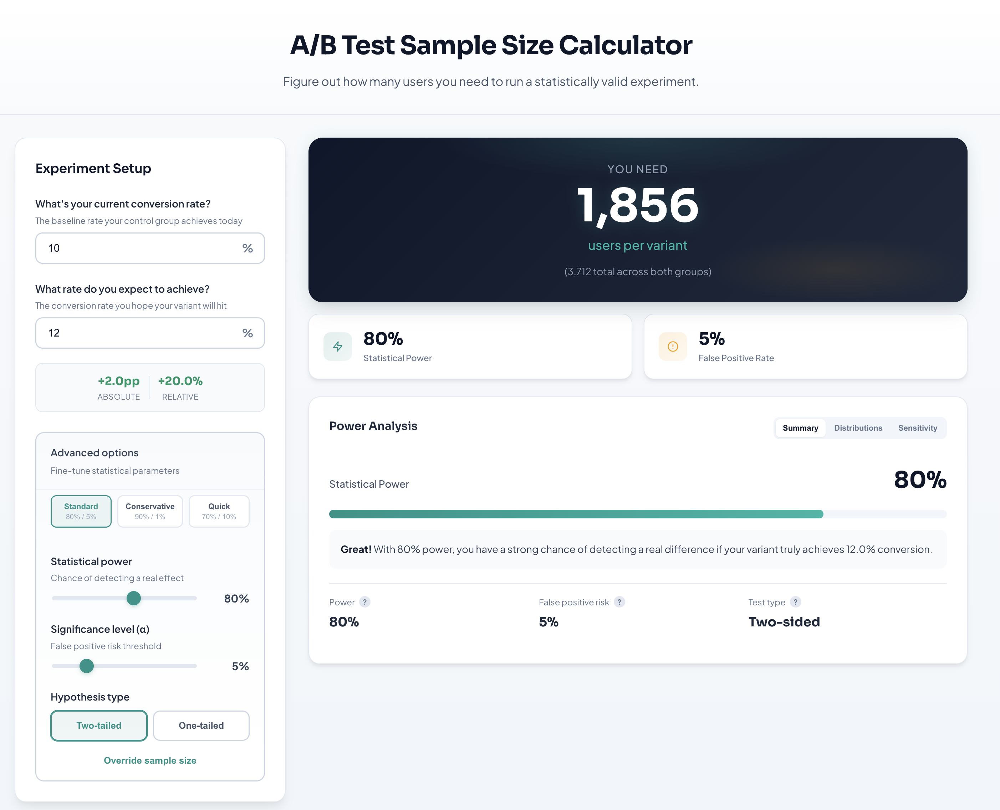
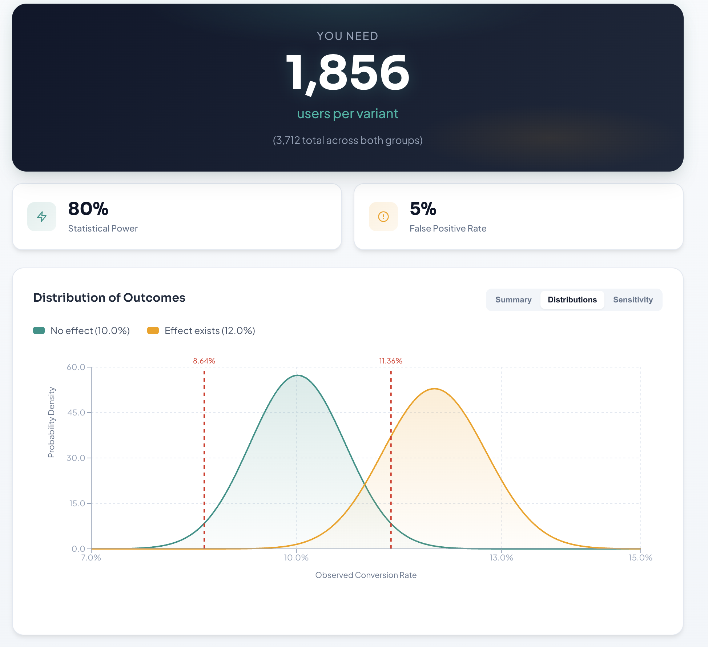

# A/B Test Sample Size Calculator

An intuitive, non-technical-first power analysis and sample size planning tool. Figure out exactly how many users you need to run a statistically valid experiment.



## Features

### Instant Sample Size Calculation

Enter your baseline conversion rate and expected improvement to instantly see how many users you need per variant. The calculator shows both the per-variant sample size and total users required across both groups.

###  Distribution Visualization

Understand the statistics visually with interactive distribution charts showing what outcomes to expect:

- **No effect distribution** (teal): What you'd observe if there's truly no difference
- **Effect exists distribution** (orange): What you'd observe if your variant achieves the expected lift
- **Critical thresholds**: Clear markers showing decision boundaries



### Sensitivity Analysis

Explore the trade-off between sample size and detectable effect size. See what minimum effect you can reliably detect at different traffic levels:

- Toggle between **Relative %** and **Absolute percentage point** views
- Interactive curve showing your current settings
- Understand how more traffic lets you detect smaller effects


### Advanced Statistical Controls

Fine-tune your experiment parameters with professional-grade options:

| Option | Description |
|--------|-------------|
| **Statistical Power** | Chance of detecting a real effect (default: 80%) |
| **Significance Level (α)** | False positive risk threshold (default: 5%) |
| **Hypothesis Type** | Choose between two-tailed or one-tailed tests |
| **Presets** | Quick access to Standard (80%/5%), Conservative (90%/1%), or Quick (70%/10%) configurations |

### User-Friendly Design

- **Plain-language labels**: No statistical jargon in the main interface
- **Visual intuition**: See the overlap between null and alternative distributions
- **Conversion-rate axis**: X-axis displays actual percentages, not z-scores
- **Single-screen clarity**: All key information visible at once
- **Real-time updates**: Results update instantly as you adjust parameters

---

##  Quick Start

### Docker (Recommended)

The easiest way to run the full application:

```bash
# Build and run with Docker Compose
docker compose up --build
```

Open [http://localhost:8000](http://localhost:8000) in your browser.

### Manual Build

```bash
# Build and run manually
docker build -t ab-test-calculator .
docker run -p 8000:8000 ab-test-calculator
```

---

## ☁️ Deploy to Cloud Platforms

### Railway

[](https://railway.app/new)

1. Connect your GitHub repository
2. Railway will auto-detect the `railway.json` configuration
3. Deploy!

### Fly.io

```bash
# Install flyctl, then:
fly launch --no-deploy
fly deploy
```

### Render

1. Connect your GitHub repository on [render.com](https://render.com)
2. Select "Blueprint" and point to `render.yaml`
3. Deploy!

---

## 🛠️ Local Development

### Backend (FastAPI)

**Prerequisites:** Python 3.10+, Poetry

```bash
cd backend
poetry install
poetry run uvicorn app.api:app --reload --port 8000
```

Open the interactive API docs at `http://127.0.0.1:8000/docs`.

#### API Endpoints

| Endpoint | Description |
|----------|-------------|
| `POST /power-curve` | Returns power, beta, critical values, and curve data for visualization |
| `POST /sample-size` | Returns required sample size per variant plus lift metadata |

### Frontend (React + Vite)

**Prerequisites:** Node.js 18+, npm

```bash
cd frontend
npm install
npm run dev
```

Override the backend URL by creating `frontend/.env`:

```
VITE_API_BASE_URL=http://your-backend-host:8000
```

#### Production Build

```bash
cd frontend
npm run build
npm run preview  # optional smoke test
```

---

## 🧪 Testing

### Backend Tests

```bash
cd backend
poetry install --with dev
poetry run pytest
```

See [`backend/TESTING.md`](backend/TESTING.md) for detailed testing documentation.

### Coverage

- **Target**: >85% code coverage
- **Current**: ~95% (core functions fully tested)

### Continuous Integration

GitHub Actions automatically runs tests before any merge to `main`:
- ✅ Full test suite
- ✅ Coverage verification
- ✅ Python 3.11 compatibility
- ✅ Coverage reports

---

## 📁 Project Structure

```
├── backend/           # FastAPI service
│   ├── app/
│   │   ├── api.py              # REST endpoints
│   │   └── powercalculator.py  # Statistical calculations
│   └── tests/                  # pytest test suite
├── frontend/          # React + TypeScript SPA
│   └── src/
│       ├── components/         # UI components
│       │   ├── ExperimentForm.tsx
│       │   ├── MetricSummary.tsx
│       │   ├── PowerCurveChart.tsx
│       │   ├── MdeTradeoffChart.tsx
│       │   └── AdvancedSettings.tsx
│       └── App.tsx
├── Dockerfile         # Multi-stage production build
├── docker-compose.yml
└── screenshots/       # Documentation images
```

---

## 📝 License

MIT

---

## 🤝 Contributing

Contributions are welcome! Please ensure tests pass before submitting a PR:

```bash
cd backend && poetry run pytest
cd frontend && npm run lint
```
